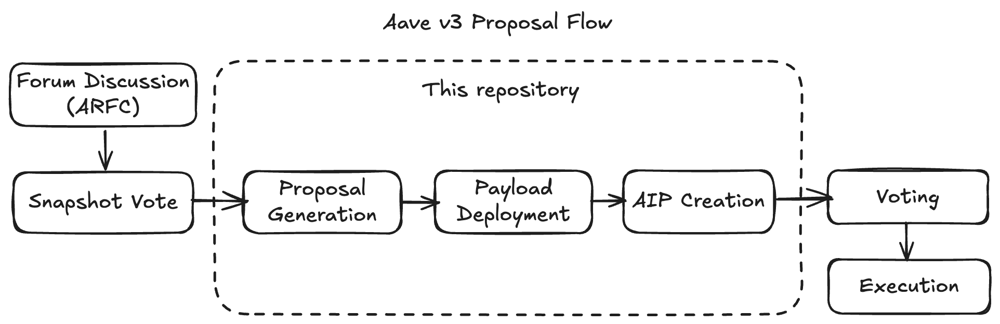

# Aave Proposals v3

This repository contains various proposals targeting the Aave governance.
In addition to the actual proposals this repository also contains tooling to standardize certain protocol tasks.
The tooling documentation is co-located with the relevant smart contracts.

## Architecture



**Governance Process**:

1. **Forum Discussion (ARFC)** → Community feedback
2. **Snapshot Vote** → Off-chain temperature check

**This repository**:

3. **Proposal Generation** → Generate proposal files (`npm run generate`)
4. **Payload Deployment** → Deploy to target chain (e.g., Arbitrum)
5. **AIP Creation** → Create on-chain proposal

**On-chain Governance**:

6. **Voting & Execution** → Community vote and on-chain execution

## Repository Structure

```
aave-proposals-v3/
├── docs/              # Documentation
├── src/               # Proposal payloads (Solidity)
│   └── YYYYMMDD_*/    # Individual proposals (date-based)
├── zksync/            # zkSync-specific code
│   └── src/           # zkSync proposal payloads
├── generator/         # TypeScript CLI tool
├── diffs/             # Protocol state diffs (before/after)
└── lib/               # Foundry dependencies
```

## Key Components

### Proposal Payloads (`src/`)

Smart contracts that execute protocol changes on specific chains. Payloads inherit from base classes like `AaveV3PayloadEthereum`, `AaveV3PayloadArbitrum`, etc. Each proposal is stored in a date-based directory (`YYYYMMDD_<Chain>_<Title>/`).

### Generator (`generator/`)

Interactive CLI tool to bootstrap proposal files. Runs `npm run generate` to create `.sol` (payload), `.t.sol` (tests), `.s.sol` (deployment scripts), `.md` (AIP documentation), and `config.ts` (reproducibility config) files based on interactive prompts for chains, features, and parameters.

See [Generator Guide](./generator/README.md) for detailed usage.

### Config Engine (`aave-v3-origin`)

The AaveV3ConfigEngine ([Docs](https://github.com/aave-dao/aave-helpers/tree/master/src/v3-config-engine#how-to-use-the-engine)) is a helper smart contract to abstract good practices when doing "admin" interactions with the Aave v3 protocol, but built on top, without touching the core contracts.

A less comprehensive version of the engine also exists for [protocol v2](https://github.com/aave-dao/aave-helpers/tree/master/src/v2-config-engine).

### Testing Infrastructure

Foundry (Forge) with fork testing, snapshot diffing, and comprehensive validation suite. See [Testing Guide](./docs/TESTING_GUIDE.md) for details.

## Quick Start

### Setup

```sh
cp .env.example .env
forge install
npm i
```

### Test

```sh
# You can use vanilla forge to customize your test
# https://book.getfoundry.sh/reference/forge/forge-test
forge test
make test-contract filter=ProposalName
```

See [Testing Guide](./docs/TESTING_GUIDE.md) for more detailed information.

## Proposal Creation

Generate required files:

```sh
npm run generate
```

See [Generator Guide](./generator/README.md) for detailed usage.

To create a proposal you have to do three things:

1. deploy the payload & register it on the payloadsController
2. create an AIP
3. create the mainnet proposal

While the first two steps can be performed in parallel, the final proposal creation relies on (1) and (2).
Every step can in theory be performed by a different entity.

The address creating the mainnet proposal(3) requires 80k AAVE of proposition power.

### 1. Deploy payload

The payload is always deployed on the chain it affects. Deployment uses Foundry Forge with Ledger support and automatic Etherscan verification.

**Commands**:

```bash
# Deploy with Ledger
make deploy-ledger contract=<path/to/Script.s.sol:ScriptName> chain=<chainAlias>

# Dry run (simulation)
make deploy-ledger contract=<path/to/Script.s.sol:ScriptName> chain=<chainAlias> dry=true
```

Generated `.s.sol` files contain deployment commands in comments. Chain aliases defined in [foundry.toml](foundry.toml) `[rpc_endpoints]` section.

### 2. Create an AIP

The aip can be co-located with the proposal code as a markdown file.
This repository will manage the upload to IPFS automatically via [GitHub Actions](.github/workflows/ipfs.yml) once a PR is merged to `main`.

Write the AIP documentation (analysis, rationale, specification) in the generated `.md` file.

### 3. Create proposal

The proposal requires at least one `payload` and the `encodedHash`.

Requires 80k AAVE proposition power. Command from `command:` comment in `.s.sol` file:

```sh
make deploy-ledger contract=<path/to/Script.s.sol:ScriptName> chain=mainnet
```

## Troubleshooting Verification

If Etherscan verification fails:

1. Copy `verify.example.json` to `verify.json`
2. Add `ETHERSCAN_API_KEY` to `.env`
3. Replace `chain` with appropriate chainId
4. Replace `hash` with deployment transaction hash
5. Run `FOUNDRY_PROFILE=<chainAlias> forge build --force`
6. Run `FOUNDRY_PROFILE=<chainAlias> npx catapulta-verify -b verify.json`

## Related Documentation

- [Generator Guide](./generator/README.md) - Creating proposals step-by-step
- [Testing Guide](./docs/TESTING_GUIDE.md) - Testing proposals
- [Glossary](./docs/GLOSSARY.md) - Repository-specific terminology
- [GHO Launch Guide](./src/helpers/gho-launch/README.md) - Helper contracts for GHO cross-chain deployment

## License

MIT - see [LICENSE](./LICENSE)
